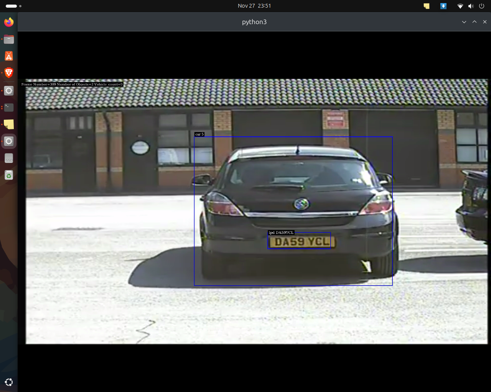

# Number Plate Recognition using NVIDIA DeepStream

This project demonstrates a real-time license plate detection and recognition system built using NVIDIA DeepStream SDK. It uses multiple neural networks in a pipeline to detect vehicles, locate license plates, and perform OCR to read the plate numbers.

## Sample Output

### Visual Output


### Terminal Output


## Prerequisites

- NVIDIA DeepStream SDK 7.1
- Python 3.10
- Gst-python
- NVIDIA GPU with compute capability 6.0 or higher
- Ubuntu 20.04 or 22.04

## Project Structure

```
Number_plate_recognition_Deepstream_OCR_NVIDIA/
├── models/
│   ├── lpdetect/              # License plate detection model
│   ├── lprecog/               # License plate recognition model  
│   └── trafficcamnet/         # Vehicle detection model
├── Results/                   # Output images and videos
├── nvinfer_custom_lpr_parser/ # Custom parsers for license plate recognition
├── deepstream_number_plate.py # Main application
├── dstest2_pgie_config.txt   # Primary detector config
├── dstest2_sgie1_config.txt  # Secondary detector config (LP detection)
├── dstest2_sgie2_config.txt  # Secondary detector config (LP recognition)
└── dstest2_tracker_config.txt # Object tracker config
```

## Model Details

1. Primary Detector (pgie):
   - ResNet-18 based TrafficCamNet model
   - Detects vehicles, road signs, two-wheelers and persons
   - INT8 quantized for optimal performance

2. License Plate Detector (sgie1):
   - LPDNet model optimized for US license plates
   - Detects license plate regions on vehicles
   - INT8 quantized

3. License Plate Recognition (sgie2):
   - LPRNet model for OCR
   - Recognizes alphanumeric characters
   - FP16 precision

## Pipeline Architecture

```
[File Source] -> [H264 Parser] -> [Decoder] -> [Stream Muxer] ->
[Primary Detector] -> [Tracker] -> [LP Detector] -> [LP Recognition] ->
[Video Converter] -> [On-Screen Display] -> [Video Sink]
```

## Usage

1. Clone the repository:
```bash
git clone <repo-url>
cd Number_plate_recognition_Deepstream_OCR_NVIDIA
```

2. Run the application:
```bash
python3 deepstream_number_plate.py -i <path-to-video-file>
```

For example:
```bash
python3 deepstream_number_plate.py -i samples/sample1.mp4
```

## Results

The application provides real-time visualization with:
- Bounding boxes around detected vehicles
- License plate regions highlighted
- Recognized license plate numbers displayed
- Frame statistics (FPS, object counts)

Sample results can be found in the `Results/` folder.

## Configuration

The behavior of each neural network can be customized through their respective config files:

- `dstest2_pgie_config.txt`: Vehicle detector settings
- `dstest2_sgie1_config.txt`: License plate detector settings  
- `dstest2_sgie2_config.txt`: OCR model settings
- `dstest2_tracker_config.txt`: Object tracker parameters

## License

Copyright (c) 2019-2024 NVIDIA CORPORATION & AFFILIATES. All rights reserved.
Licensed under the Apache License, Version 2.0. See LICENSE file for details.

## Acknowledgments

This project uses models and components from:
- NVIDIA DeepStream SDK
- NVIDIA TAO Toolkit
- NVIDIA TensorRT
